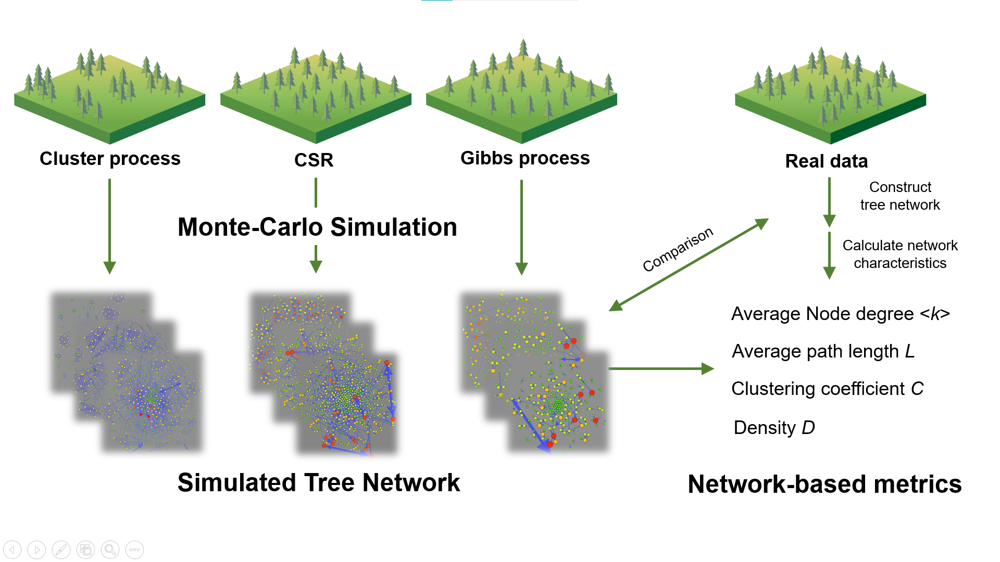

# Forest_net
Study on the Spatial Structure of Forests from the Perspective of Network  
authors: Peng Chen, Wu Haoran

## Funtions
1. `net_analyses` can do the whole analyses of a ppp class object come from `make_mod` or case data automatically. All results can be find in a directory, including a map plot, networks plot, all indexs table, and, the `res.pdf`.  
2. `to.ppp` can transfer your coordinate and crown radius data to a ppp class object.   
1. `make_mod` can construct five spatial models('CSR','Mat','HC','Tho','Str').  
2. `plot_mod` can plot the dot map of ppp class object come from `make_mod` or case data.  
3. `make_net` can construct three type of networks ('CS', 'CL', 'WCL') from a ppp class object. its result is a 'source-target-(weight)' dataframe, `graph_from_data_frame` in `igraph` package can handle this.   
4. `plot_net` can plot the three types of networks of ppp class object come from `make_mod` or case data.   
5. `chazhiplot` can do a interpolation on network metrics.

## Main
```
source('funcitons.R')
library(spatstat)
library(igraph)
library(dplyr)
library(reshape2)
library(ggpubr)
library(RColorBrewer)
```

Before you construct models, you should set the parameters:
```ground <- owin(xrange = c(0, 200), yrange = c(0,200)) #set the investigation area
max_crown <- 5
min_crown <- 2
lambda <- 0.015 #intensity
radius <- 5  #Diffusion radius
HC_R<-4 #HC model
ave_offspring_per_cluster <- 3
```

Use `net_analyses`:
```
dat3<-read.csv('case_data/example_case.csv')
to.ppp(dat3)->case_dat
plot_mod(case_dat)

net_analyse(case_dat,res_dir = './case_data/net_analyse_res/',n_simu = 30)
```

## visualization

## final result   
we can tell which process major in the construction of spatial structure.

=======
## Cite
You can find more on our publication: [Rethinking the complexity and uncertainty of spatial networks applied to forest ecology](https://www.nature.com/articles/s41598-022-16485-9)     
Please cite:     
Wu, H.-R., Peng, C. & Chen, M. Rethinking the complexity and uncertainty of spatial networks applied to forest ecology. Sci Rep 12, 15917 (2022).
